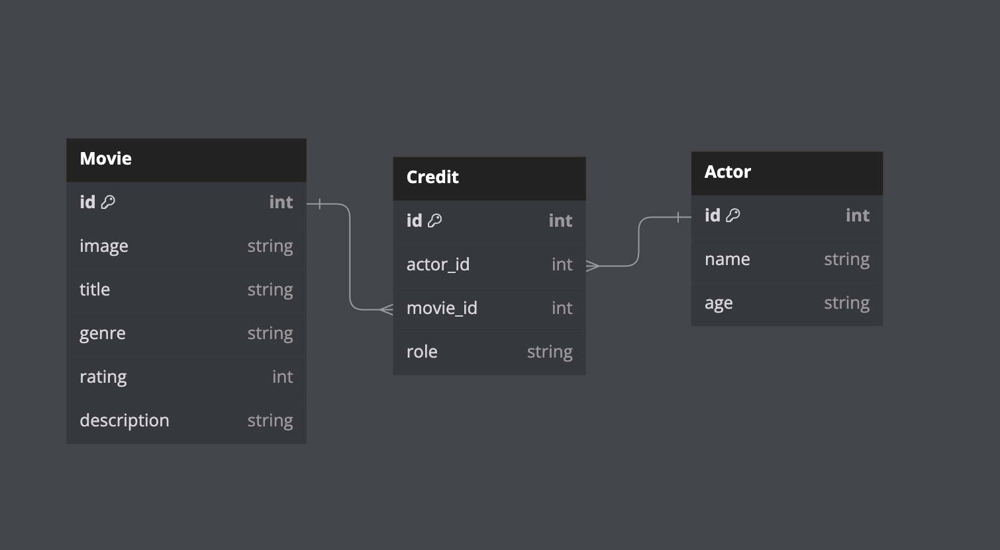

# Flask Mock Challenge - Movies and Actors

It is the year 2030 and IMDB crashed, it is up to you to create a database for people to see which actor was in which movie. You are
movie lovers only hope, may the force be with you.

In this repo:

- There is a Flask application with some features built out.
<!-- - There is a file `mock-challenge-cosmic-challenge.postman_collection.json` that
  contains a Postman collection of requests for testing each route you will
  implement. -->

You can check your API by:

- Using Postman, Thunder Client or a different request engine to make requests

---

## Setup

To download the dependencies for the frontend and backend, run:

```console
pipenv install && pipenv shell
```

You can run your Flask API on [`localhost:5555`](http://localhost:5555) by
running:

```console
python server/app.py
```

Your job is to build out the Flask API to add the functionality described in the
deliverables below.

---

## Models

It is your job to build out Movie, Actor, and Credit models so that
Actors can be in Movies. **In a given credit, one Actor will be in
 one Movie**. Over their careers, **Actors will be in many Movies**
and **Movies will be have many Actors**.

You will implement an API for the following data model:




The file `server/models.py` defines the model classes **without relationships**.
Use the following commands to create the initial database `app.db`:

```console
cd server/
export FLASK_APP=app.py
flask db init
flask db upgrade head
```

Now you can implement the relationships as shown in the ER Diagram:

- A `Actor` has many `Movie` through `Credit`s
- An `Movie` has many `Actor`s through `Credit`s
- A `Credit` belongs to a `Movie` and belongs to a `Actor`

Update `server/models.py` to establish the model relationships. Since a
`Credit` belongs to a `Actor` and a `Movie`, configure the model to
cascade deletes.

Set serialization rules to limit the recursion depth.

Run the migrations and seed the database:

```console
flask db revision --autogenerate -m 'message'
flask db upgrade head
python seed.py
```

If you aren't able to get the provided seed file working, you are welcome to generate your own seed data to test the application.

---

---

## Validations

Add validations to the `Actor` model:

- must have a `name`, and a `age` that is great than 10

Add validations to the `Credit` model:

- must have a `role`, a `actor_id` and a `movie_id`
- `role` must be either: ["Performer", "Director", "Producor", "Playwright", "Lighting Design", "Sound Design", "Set Design"].

Add validations to the `Movie` model:

- must have a `rating` between 1 and 10.
- `genre` must be one of the following: ["Action", "Comedy", "Drama", "Horror", "Romance", "RomCom"]

## Routes

Set up the following routes. Make sure to return JSON data in the format
specified along with the appropriate HTTP verb.

Recall you can specify fields to include or exclude when serializing a model
instance to a dictionary using to_dict() (don't forget the comma if specifying a
single field).

NOTE: If you choose to implement a Flask-RESTful app, you need to add code to
instantiate the `Api` class in server/app.py.

### GET /actors

Return JSON data in the format below. **Note**: you should return a JSON
response in this format, without any additional nested data related to each
actor.

<!-- ```json
[
  {
    "id": 1,
    "name": "Mel T. Valent",
    "field_of_study": "xenobiology"
  },
  {
    "id": 2,
    "name": "P. Legrange",
    "field_of_study": "orbital mechanics"
  }
]
``` -->

### GET /actors/<int:id>

If the `Actor` exists, return JSON data in the format below. Make sure to include a list of Movies for the actor.
<!-- 
```json
"field_of_study": "Orbits",
    "id": 1,
    "name": "Joseph Richard",
    "missions": [
        {
            "id": 1,
            "name": "Explore Planet X.",
            "planet": {
                "distance_from_earth": 302613474,
                "id": 8,
                "name": "X",
                "nearest_star": "Shiny Star"
            },
            "planet_id": 8,
            "scientist_id": 1
        },
        {
            "id": 10,
            "name": "Explore Planet Y.",
            "planet": {
                "distance_from_earth": 1735242898,
                "id": 14,
                "name": "Y",
                "nearest_star": "Dim Star"
            },
            "planet_id": 14,
            "scientist_id": 1
        }
    ]
}
``` -->

If the `Actor` does not exist, return the following JSON data, along with
the appropriate HTTP status code:

```json
{
  "error": "Actor not found"
}
```

### POST /actors

This route should create a new `Actor`. It should accept an object with the
following properties in the body of the request:

```json
{
  "name": "Shawn Horizon",
  "age": 52
}
```

If the `Actor` is created successfully, send back a response with the new `Actor`.

<!-- ```json
{
  "id": 3,
  "name": "Evan Horizon",
  "field_of_study": "astronavigation"
}
``` -->

If the `Actor` is **not** created successfully due to validation errors,
return the following JSON data, along with the appropriate HTTP status code:

```json
{
  "errors": ["validation errors"]
}
```

### PATCH /actors/:id

This route should update an existing `Actor`. It should accept an object
with one or more of the following properties in the body of the request:

```json
{
  "name": "Bevan Horizon",
  "age": 12
}
```

If the `Actor` is updated successfully, send back a response with the updated `Actor` and a 202 `accepted` status code.
<!-- 
```json
{
  "id": 2,
  "name": "Bevan Horizon",
  "field_of_study": "warp drive tech"
}
``` -->

If the `Actor` is **not** updated successfully, return the following JSON
data, along with the appropriate HTTP status code:

```json
{
  "errors": ["validation errors"]
}
```

OR, given an invalid ID, the appropriate HTTP status code, and the following
JSON:

```json
{
  "error": "Actor not found"
}
```

### DELETE /actors/<int:id>

If the `Actor` exists, it should be removed from the database, along with
any `Credit`s that are associated with it. If you did not set up your models to
cascade deletes, you need to delete associated `Credit`s before the `Actor`
can be deleted.

After deleting the `Actor`, return an _empty_ response body, along with the
appropriate HTTP status code.

If the `Actor` does not exist, return the following JSON data, along with
the appropriate HTTP status code:

```json
{
  "error": "Actor not found"
}
```

### GET /movies

Return JSON data in the format below. **Note**: you should return a JSON
response in this format, without any additional nested data related to each
movie.

<!-- ```json
[
  {
    "id": 1,
    "name": "TauCeti E",
    "distance_from_earth": 1234567,
    "nearest_star": "TauCeti"
  },
  {
    "id": 2,
    "name": "Maxxor",
    "distance_from_earth": 99887766,
    "nearest_star": "Canus Minor"
  }
]
``` -->

### POST /movies

This route should create a new `Movie`. It should accept an object with the following properties in the body of the request:

```json
{
  "image": "https://flxt.tmsimg.com/assets/p1036_p_v12_an.jpg",
  "title": "Blazing Saddles",
  "genre": "Action",
  "rating": 7,
  "description": "In this satirical take on Westerns, crafty railroad worker Bart (Cleavon Little) becomes the first black sheriff of Rock Ridge, a frontier town about to be destroyed in order to make way for a new railroad. Initially, the people of Rock Ridge harbor a racial bias toward their new leader. However, they warm to him after realizing that Bart and his perpetually drunk gunfighter friend (Gene Wilder) are the only defense against a wave of thugs sent to rid the town of its population."
}
```

If the `Movie` is created successfully, send back a response about the new movie.

<!-- ```json
{
  "id": 21,
  "name": "Project Terraform",
  "planet": {
    "distance_from_earth": 9037395591,
    "id": 2,
    "name": "Planet X",
    "nearest_star": "Krystal"
  },
  "planet_id": 2,
  "scientist": {
    "field_of_study": "Time travel.",
    "id": 1,
    "name": "Jeremy Oconnor"
  },
  "scientist_id": 1
}
``` -->

If the `Movie` is **not** created successfully, return the following JSON data, along with the appropriate HTTP status code:

```json
{
  "errors": ["validation errors"]
}
```

---